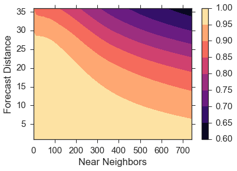

# Summary

This python package implements nonlinear time series analysis techniques, also referred to as empirical dynamic modeling,
based on many of the
workflows and routines within TISEAN[@tisean]. The package provides
a modern api, is written in pure python, and provides additional analysis routines
not provided by TISEAN. skedm is capable of reconstructing state spaces from
one, two, and even three-dimensional series. Additionally, it provides various
methods for analyzing the evolution of nearby neighbors in the reconstructed
state spaces. skedm also includes numerous one, two, and three-dimensional synthetic datasets
for researchers to explore.

The code makes use of scikit-learn's [@scikit-learn] efficient near neighbor implementation,
and allows users familiar with the scikit-learn's API [@scikit-learn-api] to easily
use skedm.

-

# References
